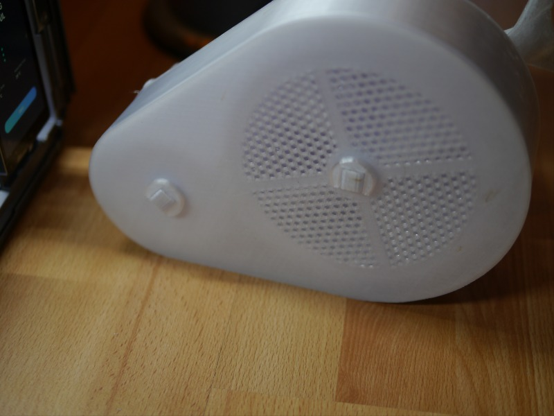

Founty
======

A toy fountain.

About
-----

I made this as my entry to the Snapmaker contest gifts for kids with my Snapmaker 2.0 A350.  
A print and assembly description is given here together with the FreeCAD project file in the hope that other get inspired to make their own version of it. Or just have fun with it :)  
I decided to put it into an Github repository to track changes and collect improvements on it. Let's see how well that works.

**Unfortunately, the used pump mechanism of the current version does not work ☹️.** Maybe someone knows how to fix this.

Print
-----

The parts can be mashed in the `Mesh Design` workspace of FreeCAD to the desired resolution and exported to STL for printing. I used Cura to slice the files at 0.2mm layer height with a 0.4mm diameter nozzle and 3.5mm gyroid infill if not stated different. PETG is used as filament as it was designed to be used in water. Use the recommended print orientation as shown below.

Note that PETG tends to stringing. I used the stock hotend components and have done E-step calibration and linear acceleration calibration but not retraction calibration. Polylite PETG printed quite well at 240°C and 70°C build plate temperature.

`LowerFrameCut`

`UpperFrame`

`Turn`, `PumpThreadCut` (42h print)

`Holder`

`AdapterLock`

`PumpBottomWasher`, `TurnBottomWasher`, `TurnTopWasher` (print in sequence)

`TurnShaftPrintGroup`, `PumpShaft` (0.12mm layer height, tree supports touching build plate)

`AdapterLockCut`

`WhaleFinalCut` (0.3mm layer height, tree supports touching build plate, support eraser for mouth and eyes)

`TurnLock`, `PumpLock`, `MainLockLeft`, `MainLockRight`, `MainLockPipe` (print in sequence)

Assembly
========

No glue is needed. Everything is assembly with snap-fits. Just follow the steps below and paint it with acrylic colors to your liking at the end.

1. Attach the `AdapterLockCut` to the `WhaleFinalCut` using `MainLockLeft`, `MainLockRight` and `MainLockPipe`.

  

2. Insert `PumpShaft` in `Holder` and both together into the assembled `AdapterLockCut`.

  

3. Attach the `UpperFrame`.

  

4. Insert `AdapterLock` and turn it to lock it.

  

5. Insert `TurnShaftPrintGroup` into `UpperFrame`.

  

6. Add `PumpBottomWasher` and `TurnBottomWasher` to `LowerFrameCut`.

  

7. Add `Turn` and `PumpThreadCut` to it. Add `TurnTopWasher` to `Turn`.

  

8. Put both halves together. Make sure the ends of `PumpShaft` and `TurnShaftPrintGroup` are sticking out.

  

9. Attach `TurnLock` to `TurnShaftPrintGroup` and `PumpLock` to `PumpShaft`.

  

Done.

